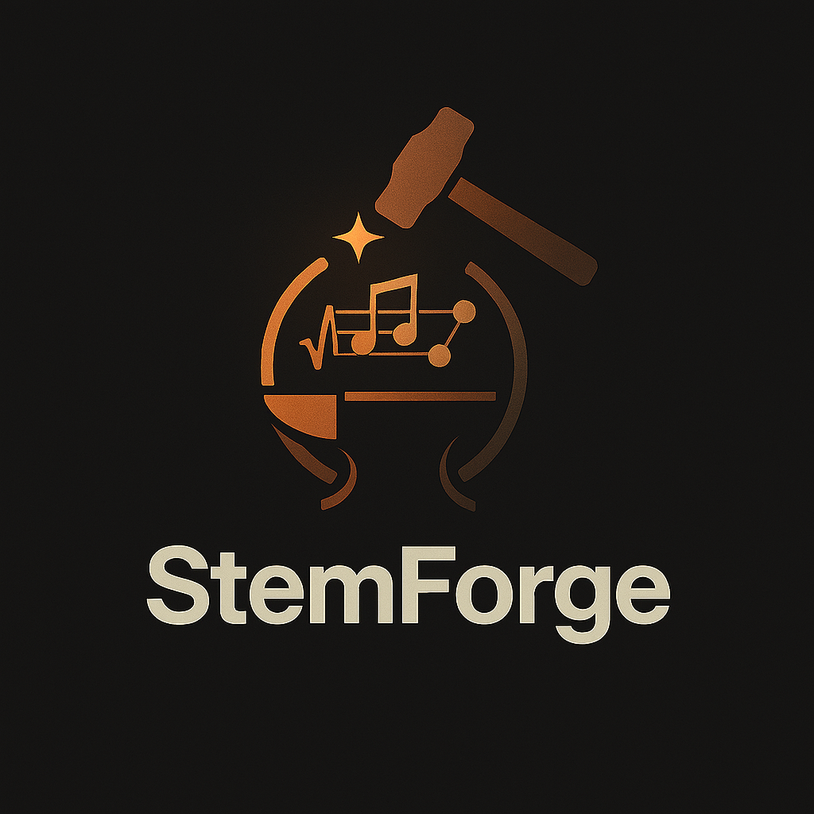

<p align="center">
  
</p>

# StemForge

**Source-available, GPU-accelerated AI audio workstation for stem separation, MIDI extraction, audio generation, and song composition — running locally in your browser.**


StemForge is a local, GPU-accelerated web application that chains multiple AI music pipelines into a single creative workflow. Upload a song, separate it into stems, extract MIDI, generate new audio or compose entirely new songs, transform vocals with AI voice conversion, generate or load special effect sound tracks, mix everything together, and export — all from one interface, all running on your own hardware. No cloud uploads, no subscriptions, no per-track fees.

## Why StemForge?

Most AI audio tools do one thing — separate stems, or generate music, or extract MIDI. StemForge connects them all. Outputs from one pipeline flow directly into the next: separate a track into stems, extract MIDI from any stem, use those stems or MIDI as conditioning for new audio generation, compose an entirely new song with AI lyrics, transform any vocal with AI voice conversion, or generate literally any sound effect with Stable Audio, then mix and export the result. It is a source-available alternative to cloud-based stem separation services like LALAL.ai or iZotope RX, with the added ability to generate, compose, transform, and remix — not just separate.

StemForge runs entirely on your local machine with no internet connection required after initial model downloads. Your audio never leaves your computer.

## Features

- **Demucs** — stem separation (vocals, drums, bass, other) — 4 models including fine-tuned and MDX variants
- **BS-Roformer** — high-quality AI stem separation with 2-stem vocal, 4-stem, and 6-stem (guitar + piano) models
- **MIDI extraction** — polyphonic BasicPitch for instruments, faster-whisper + pitch tracking for vocals; per-stem MIDI preview via FluidSynth
- **Enhance** — three-mode vocal enhancement: Clean Up (8 UVR denoise/dereverb presets), Tune (CREPE + Praat PSOLA auto-tune with key/scale snapping), Effects (planned)
- **Stable Audio Open** — text-conditioned audio generation up to 600 s, with optional audio and MIDI conditioning (Synth tab)
- **SFX Stem Builder** — DAW-style timeline canvas for placing audio clips with per-clip fades and volume, aligned to a reference stem (Synth tab)
- **AceStep** — full AI song generation from style descriptions + lyrics, with Create, Rework, Lego, and Complete modes (Compose tab); LoRA/LoKR adapter training pipeline with live loss chart, snapshots, and export
- **RVC Voice Conversion** — AI voice transformation via vendored Applio inference; 14 built-in voices, searchable HuggingFace model browser, pitch shift, F0 method selection (Compose tab → Voice mode)
- **Mix** — multi-track mixer combining audio stems, MIDI-rendered tracks, synth outputs, and composed songs; per-track instrument, volume, multi-track preview, and FLAC render
- **Export** — transcode any pipeline output (stems, MIDI, mix, generated audio, composed songs) to wav / flac / mp3 / ogg

Everything runs locally with deterministic environments via uv.

**Tab bar:** Separate · Enhance · MIDI · Synth · Compose · Mix · Export

See [INSTRUCTIONS.md](docs/INSTRUCTIONS.md) for a guide to every tab, or [Future Plans](docs/FUTURE_PLANS.md) for the roadmap.

---

## Quick Start

```bash
git clone --recursive git@github.com:tsondo/StemForge.git
cd StemForge
uv sync
uv run python run.py
# Open http://localhost:8765
```

See [Requirements](#requirements) and [Install & Run](#install--run) below for full details including system dependencies.

---

## Requirements

### uv
StemForge uses [uv](https://docs.astral.sh/uv/) to manage the Python version and all dependencies.
Install it once and `uv sync` takes care of the rest.

Ubuntu / Debian:

    curl -LsSf https://astral.sh/uv/install.sh | sh

Fedora / RHEL / CentOS:

    curl -LsSf https://astral.sh/uv/install.sh | sh

Arch / Manjaro:

    sudo pacman -S uv

openSUSE:

    curl -LsSf https://astral.sh/uv/install.sh | sh

Any distro (pipx fallback):

    pipx install uv

After installing, open a new terminal (or run `source $HOME/.local/bin/env`) so the `uv`
command is on your PATH.

### FFmpeg >= 5.1 (with development headers)
Required for audio decoding.

Ubuntu 22.04:

    sudo add-apt-repository -y ppa:ubuntuhandbook1/ffmpeg7
    sudo apt update
    sudo apt install ffmpeg libavcodec-dev libavformat-dev libavdevice-dev \
        libavfilter-dev libavutil-dev libswscale-dev libswresample-dev

Ubuntu 24.04+:

    sudo apt install ffmpeg libavcodec-dev libavformat-dev

Fedora:

    sudo dnf install ffmpeg-free ffmpeg-free-devel

Arch / Manjaro:

    sudo pacman -S ffmpeg

Other distros:
- Ensure ffmpeg >= 5.1
- Ensure development headers are installed

### FluidSynth + GM Soundfont (required for MIDI preview and Mix tab)

Fedora:

    sudo dnf install fluidsynth fluidsynth-devel fluid-soundfont-gm

Ubuntu / Debian:

    sudo apt install libfluidsynth3 libfluidsynth-dev fluid-soundfont-gm

Arch / Manjaro:

    sudo pacman -S fluidsynth soundfont-fluid

The GM soundfont is auto-discovered at startup.
On Fedora it installs to
`/usr/share/soundfonts/FluidR3_GM.sf2`; use the Browse button on the Mix tab
to point StemForge at a different `.sf2` file if needed.

### jemalloc (optional, recommended for multi-user / long-running deployments)

jemalloc is a memory allocator that reduces heap fragmentation and malloc lock
contention under concurrent workloads. StemForge detects and uses it automatically
at startup — no configuration needed. Particularly beneficial when running with
multiple users (`--max-users`) or leaving the server up for extended periods.

Fedora:

    sudo dnf install jemalloc

Ubuntu / Debian:

    sudo apt install libjemalloc-dev

Arch / Manjaro:

    sudo pacman -S jemalloc

Set `STEMFORGE_NO_JEMALLOC=1` in the environment to disable even when installed.
macOS is not affected (jemalloc injection is Linux-only).

### GPU (recommended)
- **NVIDIA GPU** with driver **580+** (required for CUDA 13.0 runtime)
- Check your driver version: `nvidia-smi` → top-right shows "Driver Version"
- PyTorch 2.10.0+cu130 (pinned) will use the GPU automatically — no CUDA toolkit install needed
- CPU-only works but is significantly slower for all pipelines

### WSL (Windows Subsystem for Linux)

StemForge is a web application — audio playback happens in the browser, so no
PulseAudio or sounddevice setup is needed. Install FluidSynth for MIDI preview:

    sudo apt install libfluidsynth3 libfluidsynth-dev fluid-soundfont-gm

Then follow the standard Install & Run steps below.

---

## macOS Support

macOS on **Apple Silicon** (M1/M2/M3) is supported via MPS acceleration.
Intel Macs will run CPU-only.

### Setup

**Step 1** — Copy the macOS pyproject file before installing:

    cp pyproject.toml.MAC pyproject.toml
    uv sync

**Step 2** — Install FluidSynth:

    brew install fluid-synth

**Step 3** — Set the library path so pyfluidsynth can find it:

    export DYLD_LIBRARY_PATH="$(brew --prefix fluid-synth)/lib:$DYLD_LIBRARY_PATH"

Add the `export` line to your `~/.zshrc` so it persists across sessions.

### macOS limitations

- **`mdx_extra_q` Demucs model** is not available on macOS (requires `diffq`, which does not build on macOS). The model is automatically hidden from the UI.
- **BasicPitch MIDI extraction** may have limited functionality on macOS — `ai-edge-litert` (the TFLite runtime) is a Linux-only package. The MIDI tab will surface a clear error if this is attempted.
- **Vocal MIDI** (faster-whisper) works on macOS.
- **Stable Audio Open** generation works on macOS via MPS.
- **AceStep** (Compose tab) works on macOS — the subprocess handles MPS detection independently.

### Performance

MPS acceleration is used automatically when available (Apple Silicon).
Expect significantly faster inference than CPU-only, but slower than CUDA on a discrete GPU.

---

## HuggingFace Authentication (required for the Synth tab)

The Synth tab uses [Stable Audio Open 1.0](https://huggingface.co/stabilityai/stable-audio-open-1.0),
a gated model. You must accept its license and authenticate before StemForge can download it.
See the [Synth section in INSTRUCTIONS.md](docs/INSTRUCTIONS.md#4-synth--audio-generation--sfx-stem-builder)
for usage details.

**Step 1 — Accept the license**

Visit https://huggingface.co/stabilityai/stable-audio-open-1.0, sign in with a free
HuggingFace account, and click **Agree and access repository**.

**Step 2 — Create a token**

Go to https://huggingface.co/settings/tokens and create a token with **Read** access.

**Step 3 — Log in locally**

    huggingface-cli login

Paste your token when prompted. It is saved to `~/.cache/huggingface/token` and
picked up automatically by StemForge on every subsequent run — you only need to do
this once.

The model weights (~2 GB) are downloaded on the first Synth run and cached under
`~/.cache/stemforge/musicgen/`.

---

## Install & Run

**Step 1** — Install system dependencies (see Requirements above): uv, FFmpeg, FluidSynth + GM soundfont.

**Step 2** — Clone (use `--recursive` to pull the AceStep submodule and its nested vendor):

    git clone --recursive git@github.com:tsondo/StemForge.git
    cd StemForge

**Step 3** — Sync environment (downloads Python 3.11, PyTorch, and all dependencies — first run takes a few minutes):

    uv sync

**Step 4** — Run:

    uv run python run.py

**Step 5** — Open http://localhost:8765 in your browser.

### First-run model downloads

All AI models are downloaded lazily on first use — StemForge does not download anything at startup.

| Pipeline | Download size | Trigger |
|----------|--------------|---------|
| Demucs separation | ~300 MB per model | First separation |
| BS-Roformer separation | ~500 MB per model | First separation |
| Stable Audio Open (Synth) | ~2 GB | First generation (requires HuggingFace auth — see below) |
| AceStep (Compose) | ~20 GB | Click "Initialize" on Compose tab |
| Enhance Clean Up (UVR) | ~100–500 MB per preset | First enhancement with that preset |
| Whisper (Vocal MIDI) | ~40–500 MB depending on model size | First vocal MIDI extraction |
| RVC Voice (Compose → Voice) | ~50–140 MB per voice model | First voice conversion with that model |

The Compose tab shows an **"Initialize"** button instead of "Generate" until AceStep is ready.
Clicking it starts the backend and downloads models if needed (can take 10–30 min on the first run).
Once initialized, the button switches to **"Generate"** and stays that way for the session.

### Updating the AceStep submodule

When Ace-Step-Wrangler has new commits (bug fixes, model support, etc.),
pull them into StemForge:

    cd Ace-Step-Wrangler
    git pull origin main
    cd ..
    git add Ace-Step-Wrangler
    git commit -m "Update Ace-Step-Wrangler submodule"
    git push

If Wrangler's nested submodule (`vendor/ACE-Step-1.5`) also changed, pull
that first:

    cd Ace-Step-Wrangler
    git submodule update --remote vendor/ACE-Step-1.5
    git add vendor/ACE-Step-1.5
    git commit -m "Update ACE-Step vendor"
    git push origin main
    cd ..
    git add Ace-Step-Wrangler
    git commit -m "Update Ace-Step-Wrangler submodule"
    git push

After updating, run `uv sync` to pick up any dependency changes.

---

## Pipelines

### Separate
AI-powered stem separation using Demucs and BS-Roformer. Upload any audio or video file, choose an engine and model, and split it into individual stems (vocals, drums, bass, other, guitar, piano). Automatic engine and model recommendation based on spectral analysis of your audio.

### Enhance
Three-mode vocal enhancement. **Clean Up** applies UVR denoise, dereverb, or debleed via 8 curated presets across Roformer/MDXC/VR architectures. **Tune** applies auto-tune via CREPE neural pitch detection + WORLD vocoder resynthesis — choose key, scale, correction strength, and humanization. **Effects** is planned (custom DSP via scipy.signal). Batch mode supported for Clean Up.

### MIDI
Extract MIDI from separated stems. BasicPitch handles polyphonic instrument stems; faster-whisper + PYIN pitch tracking handles vocal melodies. Per-stem FluidSynth preview lets you audition MIDI renderings directly in the browser via wavesurfer.js.

### Synth
Text-conditioned audio generation via Stable Audio Open 1.0 (44,100 Hz stereo).
Optional conditioning from audio stems, MIDI, or the current mix.
Duration up to 600 s (chunked generation, 47 s per chunk).
Includes Vocal Preservation Mode.
See [INSTRUCTIONS.md](docs/INSTRUCTIONS.md#4-synth--audio-generation--sfx-stem-builder) for usage details.

### SFX Stem Builder
DAW-style canvas (inside the Synth tab) for placing audio clips on a timeline. Per-clip fades, volume controls, and alignment to a reference stem waveform. Render the canvas to a single audio file and send it directly to the Mix tab.

### Compose
Full song generation via AceStep 1.5 and voice transformation via RVC, running as managed pipelines.
See [INSTRUCTIONS.md](docs/INSTRUCTIONS.md#5-compose--full-song-generation-acestep) for usage details.

- **Initialize** — on first visit, the button says "Initialize". Click it to start the AceStep backend and download models (~20 GB on first run). Once ready, the button becomes "Generate".
- **Create mode** — build a song from genre/mood tags, song parameters, and lyrics (manual, AI-generated, or instrumental)
- **Rework mode** — transform an existing audio file via Reimagine (full regeneration) or Fix & Blend (region-targeted)
- **Train mode** — LoRA/LoKR adapter training: upload audio → scan → auto-label → preprocess → train with live loss chart → export. Named snapshots for iterating without re-processing.
- **LoRA management** — browse, load, unload, and scale (0–100%) adapters during generation
- **Voice mode** — AI voice conversion via RVC (Retrieval-based Voice Conversion). Select a separated vocal stem or load any audio file, choose from 14 built-in voices (Freddie Mercury, Adele, Drake, etc.) or search HuggingFace for thousands more. Controls for pitch shift, F0 extraction method, voice character, and consonant protection. Voice models auto-download on first use (~50–140 MB each).
- **Cross-tab integration** — send composed or voice-transformed audio to Separate for stem extraction, or to Mix for multi-track blending
- **Seed recall** — Last/Random buttons for reproducible generation; use `--deterministic` flag for A/B testing

AceStep model weights are cached under `MODEL_LOCATION` (default `~/.cache/stemforge/`) or `checkpoints/` in the submodule if unset.

### Mix
Combines audio stems, MIDI-rendered tracks, synth outputs, and composed songs into a single stereo mix.
Tracks appear automatically after Separate, MIDI extraction, Synth generation, or Compose.
Per-track volume controls, instrument selection (MIDI tracks), and enable/disable toggle.
Renders to FLAC.

### Export
Select any combination of pipeline outputs, choose format (wav/flac/mp3/ogg),
and download individually or as a ZIP archive.

---

## Launcher flags

| Flag | Default | Description |
|------|---------|-------------|
| `--port` | 8765 | StemForge server port (also `STEMFORGE_PORT` env var) |
| `--no-acestep` | off | Disable AceStep subprocess — all tabs except Compose work normally |
| `--acestep-port` | 8001 | AceStep API port (also `ACESTEP_PORT` env var) |
| `--gpu N` | auto | Set `CUDA_VISIBLE_DEVICES=N` on the AceStep subprocess only |
| `--model-dir` | `~/.cache/stemforge/` | Shared model cache directory (also `MODEL_LOCATION` env var) |
| `--deterministic` | off | Near-greedy LM temperature + CUDA deterministic ops when seed is set — useful for A/B testing LoRA vs base model |

---

## Model Cache & Logs

Models:

    ~/.cache/stemforge/

Logs:

    ~/.local/share/stemforge/logs/stemforge.log

### Shared model cache

Two users on the same workstation can avoid duplicate downloads by pointing at a single directory:

    # Via .env file (recommended — persists across sessions)
    echo 'MODEL_LOCATION=/data/models' >> .env

    # Via environment variable
    MODEL_LOCATION=/data/models uv run python run.py

    # Via CLI flag
    uv run python run.py --model-dir /data/models

All model loaders (Demucs, BS-Roformer, Stable Audio Open, Whisper, AceStep) will read from and write to that path. Demucs downloads (via `torch.hub`) are redirected by setting `TORCH_HOME` automatically. AceStep (Ace-Step-Wrangler) reads the same `MODEL_LOCATION` variable for its checkpoint directory.

---

## Current Status

All pipelines and the full web UI are implemented and working:

- Demucs separation — 4 models, CUDA fallback for MDX-Net
- BS-Roformer separation — 6 models including 4-stem and 6-stem (guitar + piano)
- Automatic engine/model recommendation from spectral audio analysis
- MIDI extraction — BasicPitch for instruments, faster-whisper + pitch for vocals
- MIDI preview — per-stem FluidSynth render, streamed to browser via wavesurfer.js
- Stable Audio Open generation (Synth tab) — text + audio + MIDI conditioning, up to 600 s (chunked at 47 s), Vocal Preservation Mode
- Enhance tab — Clean Up (8 UVR presets, batch mode), Tune (CREPE + Praat auto-tune), Effects (stub)
- SFX Stem Builder — DAW timeline, clip placement with fades, align-to reference, render to Mix
- AceStep generation (Compose tab) — full song creation/rework, AI lyrics, 3-column UI, cross-tab integration, LoRA/LoKR training pipeline, adapter management, seed recall, dismissable result cards
- RVC voice conversion (Compose tab → Voice mode) — 14 built-in voices, HuggingFace search/import, local .pth upload, pitch/F0/index controls
- Mix tab — per-track instrument/volume controls, audio/MIDI/synth/compose source types, FLAC render
- Export panel — all pipeline outputs, 4 audio formats (wav/flac/mp3/ogg), zip download
- Waveform visualization via wavesurfer.js with global transport bar
- Deterministic uv environment, Python 3.11, CUDA 13.0 wheels
- macOS support via MPS acceleration (separate `pyproject.toml.MAC`)

StemForge is evolving into a musical playground where you can regenerate and remix any part of any song.

---

## Project Structure

    StemForge/
    ├── run.py                          # Launcher: uvicorn + AceStep subprocess management
    ├── pyproject.toml
    ├── pyproject.toml.MAC              # macOS variant (MPS, no CUDA index)
    │
    ├── Ace-Step-Wrangler/              # Git submodule (independently runnable)
    │   ├── vendor/ACE-Step-1.5/        # Nested submodule — upstream AceStep
    │   ├── backend/                    # Wrangler's standalone backend (reference)
    │   ├── frontend/                   # Wrangler's standalone frontend (reference)
    │   └── run.py                      # Wrangler's standalone launcher (unused in StemForge)
    │
    ├── vendor/rvc/                     # Vendored Applio RVC inference code (MIT)
    │   ├── infer/                      # VoiceConverter + Pipeline
    │   ├── lib/                        # Algorithms, pitch extractors, utilities
    │   ├── models/                     # Synthesizer architectures
    │   └── configs/                    # Sample rate configs
    │
    ├── docs/
    │   ├── INSTRUCTIONS.md             # User guide — how to use each tab
    │   ├── CURRENT_STATE.md             # Current state and design values
    │   └── FUTURE_PLANS.md             # Roadmap: voice training, effects, packaging, DAW integration
    │
    ├── backend/
    │   ├── main.py                     # FastAPI app, router registration, static mount
    │   ├── api/
    │   │   ├── system.py               # /api/health, /api/device, /api/models, /api/session
    │   │   ├── audio.py                # /api/upload, /api/audio/stream|download|waveform|info|profile
    │   │   ├── separate.py             # /api/separate, /api/separate/batch
    │   │   ├── enhance.py             # /api/enhance, /api/enhance/autotune
    │   │   ├── midi.py                 # /api/midi/extract, /api/midi/render, /api/midi/save
    │   │   ├── generate.py             # /api/generate (Stable Audio Open)
    │   │   ├── compose.py              # /api/compose/* (AceStep proxy, LoRA, training)
    │   │   ├── acestep_wrapper.py      # httpx async client for AceStep REST API
    │   │   ├── voice.py               # /api/voice/* (RVC voice conversion)
    │   │   ├── sfx.py                 # /api/sfx/* (SFX Stem Builder)
    │   │   ├── mix.py                  # /api/mix/render, /api/mix/tracks
    │   │   └── export.py               # /api/export
    │   └── services/
    │       ├── job_manager.py          # Background thread runner + progress tracking
    │       ├── session_store.py        # Thread-safe state: audio, stems, MIDI, mix, compose
    │       ├── pipeline_manager.py     # Lazy-loaded pipeline singletons with GPU lock
    │       └── acestep_state.py        # AceStep subprocess lifecycle management
    │
    ├── frontend/                       # Vanilla HTML/CSS/JS SPA (served by FastAPI)
    │   ├── index.html
    │   ├── style.css                   # Dark DAW aesthetic
    │   ├── app.js                      # Tab router, event bus, session management
    │   └── components/                 # Per-tab JS modules
    │
    ├── pipelines/                      # ML pipeline implementations
    │   ├── demucs_pipeline.py
    │   ├── roformer_pipeline.py
    │   ├── midi_pipeline.py
    │   ├── basicpitch_pipeline.py
    │   ├── vocal_midi_pipeline.py
    │   ├── musicgen_pipeline.py
    │   ├── enhance_pipeline.py
    │   ├── autotune_pipeline.py
    │   └── rvc_pipeline.py
    │
    ├── models/                         # Model registry + loaders
    │   ├── registry.py
    │   ├── demucs_loader.py
    │   ├── roformer_loader.py
    │   └── musicgen_loader.py
    │
    └── utils/                          # Shared utilities
        ├── cache.py                    # Model cache dir resolution
        ├── paths.py                    # Output directory constants
        ├── audio_io.py                 # read_audio / write_audio
        ├── device.py                   # get_device / is_mps
        ├── platform.py                 # OS-idiomatic data paths
        ├── logging_utils.py            # Rotating file + console logging
        └── errors.py                   # Custom exception hierarchy

---

## Troubleshooting

**`uv sync` fails with resolver errors**
Ensure you cloned with `--recursive`. If the `Ace-Step-Wrangler/vendor/ACE-Step-1.5/` directory is empty, run:

    git submodule update --init --recursive

**`nvidia-smi` not found or shows old driver**
Install or update the NVIDIA driver to 580+ for CUDA 13.0 support.
On Fedora: `sudo dnf install akmod-nvidia` (RPM Fusion).
On Ubuntu: `sudo apt install nvidia-driver-580` (or newer).

**FluidSynth soundfont not found**
MIDI preview and Mix tab require a GM soundfont. Verify it's installed:

    ls /usr/share/soundfonts/    # Fedora
    ls /usr/share/sounds/sf2/    # Ubuntu/Debian

**Compose tab shows "Initialize" but startup fails**
Check the terminal for AceStep error output. Common causes:
- Not enough disk space for ~20 GB model download
- Not enough GPU VRAM (16 GB recommended; use `ACESTEP_VAE_ON_CPU=1` to offload)
- Network timeout during model download — just click Initialize again to resume

**Synth tab fails with "gated model" error**
You need HuggingFace authentication — see the HuggingFace Authentication section above.

---

## Acknowledgments

StemForge is built on many outstanding projects — Demucs, BS-Roformer,
Basic Pitch, Whisper, Stable Audio Open, ACE-Step, Applio/RVC, wavesurfer.js, and more.
See [ACKNOWLEDGMENTS.md](ACKNOWLEDGMENTS.md) for the full list with links and references.

---

## License

StemForge is licensed under the [PolyForm Noncommercial License 1.0.0](LICENSE).
Free for personal, educational, research, and other noncommercial use.

**Commercial use requires a separate commercial license.**
Contact [info@tsondo.com](mailto:info@tsondo.com) to discuss terms and pricing.
See [LICENSE-COMMERCIAL](LICENSE-COMMERCIAL) for details.

### Third-party model licenses

StemForge integrates third-party AI models that have their own upstream licenses.
Some models have restrictions on commercial use:

- **Stable Audio Open 1.0** — Stability AI Community License (commercial use
  free below $1 M annual revenue; otherwise requires a Stability AI Enterprise license)
- **jarredou 6-stem BS-Roformer** — no license specified; use at your own risk

Most other models (Demucs, AceStep, Whisper, BasicPitch, ViperX/ZFTurbo Roformer
weights) are MIT or Apache 2.0 licensed.

See [THIRD-PARTY-NOTICES.md](THIRD-PARTY-NOTICES.md) for the complete list.
